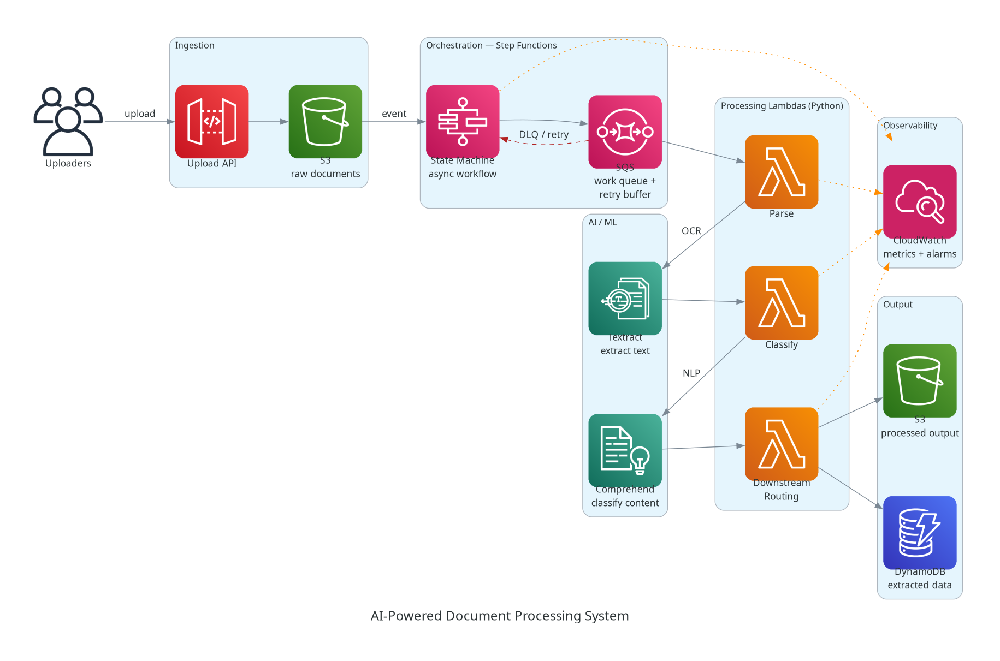
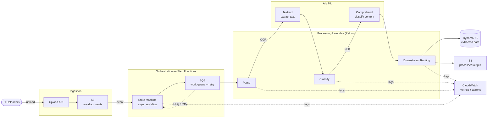

# AI-Powered Document Processing System — Architecture

> Automated document-processing pipeline using Amazon Textract and Comprehend to extract and classify content from uploaded documents.
> Repo: [github.com/bukx/ai-document-processor](https://github.com/bukx/ai-document-processor)



## Mermaid view



## Components & data flow

| Stage | Service | Responsibility |
|-------|---------|----------------|
| Ingestion | **API Gateway + S3** | Accept document uploads; land raw files in S3, which emits an event. |
| Orchestration | **Step Functions + SQS** | Drive the multi-step workflow; SQS buffers work and absorbs retries for reliable async processing. |
| Extraction | **Textract** | OCR / structured text extraction from each document. |
| Classification | **Comprehend** | NLP classification + entity detection on the extracted text. |
| Compute | **Lambda (Python)** | `parse`, `classify`, `route` functions implement parsing, classification, and downstream routing. |
| Output | **DynamoDB + S3** | Persist extracted/structured data and processed artifacts. |
| Observability | **CloudWatch** | Metrics and alarms surface pipeline health and failures. |

## Design notes
- **Reliability:** Step Functions + SQS decouple stages; failed messages flow to a DLQ and retry without losing work.
- **Error handling:** each state has explicit catch/retry; alarms fire on queue depth, Lambda errors, and state-machine failures.
- **Separation of concerns:** one Lambda per processing responsibility keeps each function small and independently scalable.

## Render the PNG
```bash
python architecture.py   # requires: pip install diagrams  +  graphviz binary
```
